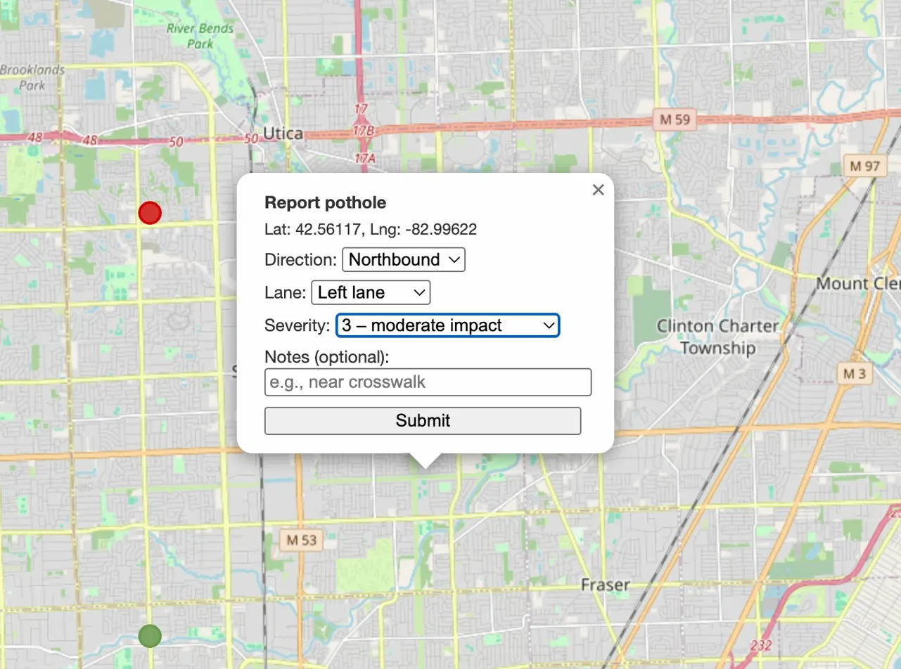
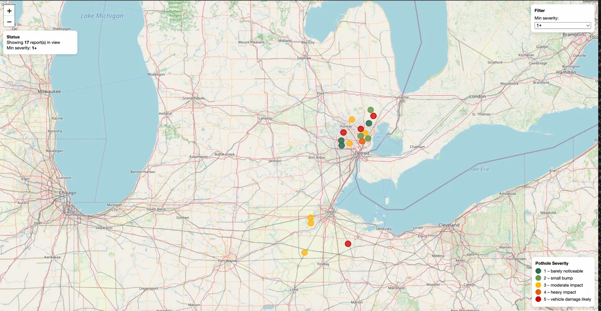
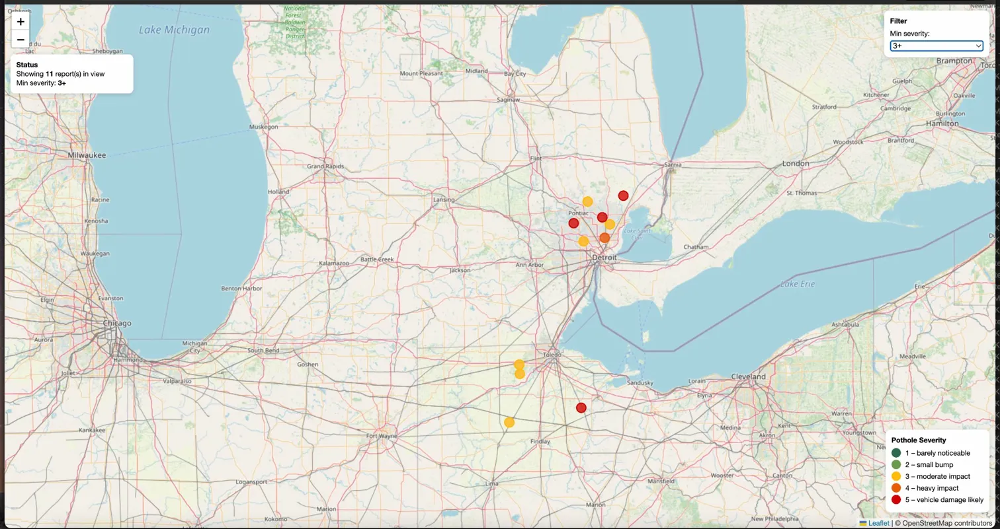

# 🕳️ Pothole Awareness

A full-stack civic reporting web application where users click directly on a map to report potholes with structured location data. Reports are color-coded by severity and visualized in real time on an interactive Leaflet.js map.

---

## Screenshots

### Map Overview


### Click-to-Report Form


### Severity Filter — All Reports (1+)


### Severity Filter — Moderate to Severe (3+)


---

## Overview

Users click anywhere on the map to open an inline report form — no separate page needed. They fill in direction of travel, lane position, severity (1–5), and optional notes. The Flask backend validates every field before persisting to SQLite. The frontend then renders the new marker instantly without a page reload.

Reports older than 7 days are automatically excluded at the database query level, keeping the map focused on current, actionable road conditions.

---

## Features

- 🖱️ **Click-to-Report** — Click anywhere on the map to open an inline popup form at that exact coordinate
- 🎨 **Severity Color Coding** — Markers are color-coded from green (minor) to red (vehicle damage likely) based on a 1–5 severity scale
- 🎚️ **Live Severity Filter** — Dropdown control filters visible markers by minimum severity in real time without reloading
- 📊 **Viewport Status Box** — Live counter showing how many reports are visible in the current map view, updates on every pan and zoom
- 🗺️ **Severity Legend** — On-map legend explaining what each color represents
- ✅ **Server-Side Validation** — Backend validates coordinate ranges, severity bounds, direction, lane values, and rejects malformed requests with descriptive errors
- 🔐 **XSS Protection** — User-submitted notes are sanitized client-side before submission
- 🕐 **7-Day Expiration** — Reports older than 7 days are filtered at the database query level, not the frontend
- 🏥 **Health Check Endpoint** — `/health` endpoint for uptime monitoring

---

## Tech Stack

| Layer | Technology |
|-------|------------|
| Backend | Python, Flask |
| Database | SQLite |
| Frontend | HTML, CSS, JavaScript, Leaflet.js |

---

## Architecture

The backend follows a REST-style API design with two endpoints:

| Method | Endpoint | Description |
|--------|----------|-------------|
| `GET` | `/api/reports` | Returns all reports newer than 7 days, ordered by most recent |
| `POST` | `/api/reports` | Validates and persists a new pothole report |
| `GET` | `/health` | Health check |

Validation on `POST` enforces:
- `lat/lng` must be valid floats within coordinate bounds (-90/90, -180/180)
- `severity` must be an integer between 1 and 5
- `direction` must be one of: northbound, southbound, eastbound, westbound
- `lane` must be one of: left, center, right, shoulder, unknown
- `notes` are optional and capped at 200 characters

The frontend is fully decoupled — it fetches report data via the API and renders markers through Leaflet.js independently of the server. New reports submitted through the form are added to the local client cache and re-rendered immediately without an additional API call.

---

## Data Model
```sql
CREATE TABLE reports (
    id          INTEGER PRIMARY KEY AUTOINCREMENT,
    lat         REAL NOT NULL,
    lng         REAL NOT NULL,
    direction   TEXT NOT NULL,
    lane        TEXT NOT NULL,
    severity    INTEGER NOT NULL,
    notes       TEXT,
    created_at  TEXT NOT NULL
);
```

---

## Project Structure
```
potholeawareness/
├── app.py           # Flask application, API endpoints, validation logic
├── templates/
│   └── index.html   # Full frontend — map, controls, form, rendering logic
└── README.md
```

> **Note:** `potholes.db` is generated automatically when you run the app for the first time.

---

## Running Locally
```bash
git clone https://github.com/tammamahad/potholeawareness.git
cd potholeawareness
pip install flask
python app.py
```

Open your browser at `http://localhost:5050`

---

## What I Learned

The most interesting design decision in this project was where to put the filtering logic. I deliberately kept the 7-day expiration on the backend query rather than the frontend — if I filtered client-side, the server would still be sending stale data over the network. Pushing it to the `WHERE` clause means the database does the work and the response stays lean.

The severity filter works the opposite way — it runs client-side because all reports are already loaded and re-querying the server on every dropdown change would be unnecessary overhead. Deciding which logic belongs where was a useful exercise in thinking about data flow.

---

## Future Improvements

- User authentication for report ownership and editing
- Mobile-friendly interface with GPS auto-fill for coordinates
- API-level distance filtering to complement the viewport status box
- Cloud deployment with a persistent database

---

## Author

**Tammam Ahad** — Computer Science, Wayne State University
GitHub: [@tammamahad](https://github.com/tammamahad)
